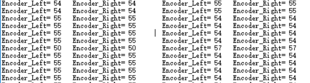

type-c连接

#### 2020.11.28

在使用STM32F103C8T6的TIM3_CH2的时候使用端口重映射到PB.5时会出现相应的定时器功能，==但数据手册上并未显示在remap行列==详细内容	——>							[点击此处](https://blog.csdn.net/daoshuti/article/details/54017994)

#### 2020.12.7

32一次打板失败，测试得到ams1117电路可正常运行，但ch340一键下载部分整段垮掉，漏连导线，原理图连接错误（关键是商家给的有问题，淦！）

且部分电路可以简化，稳压电路的钽电容和普通电容可以互换（一般电解电容容量都比普通电容大），经过测试ams1117-3.3使用两个**10uf**钽电容输出电压不会有太大变化，由于强烈的减小板框的面积的想法，第二次决定直接删去其余0.1uf的电容。

#### 2020.12.13

在使用Clion开发时几点注意：当使用STM32CubeMX重新配置芯片型号时，保存的位置需与Clion的位置一致，书写格式为

而Clion工程建立的位置为

#### 2020.12.15

刚搞完STM32的PWM以及MPU6050的角度角度计算，明天解决MPU6050的加速度获取，尝试PID计算融合。

#### 2020.12.17

我来整理思路了。。

解决MPU6050的读数问题，需要使用IIC通信协议，从其寄存器中读出相应数据。

而在使用IIC的过程中需要清楚，IIC分为硬件IIC与软件IIC。硬件IIC在STM32上面一般为复用引脚，需要对其特定引脚进行相应配置；而软件IIC则需要通过高低电平模拟IIC通信。

硬件IIC传输速度较快，但不稳定。

软件IIC则比较稳定，但速度不如硬件IIC。

在通过IIC获取相应数据时，需要函数对寄存器进行相应的读写，这就牵扯到寄存器的配置。通过MPU6050的Datasheet得到相应数据。

之前过于心急，总想折直接拿例程来用，但很多时候例程并不能之间使用，更改引脚有时并不能达到目的，只能作为参考。虽然有了角度融合的Y,R,P但我找了半天也没有看到原始数据，（那例程用的是内置DMP）无奈，还是得自己写一个啊。

承载差分信号的差分线主要优势有：抗干扰能力强，能有效抑制EMI、时序定位精确等，对于PCB工程师来说，最关注的是如何确保在实际走线中能完全发挥差分线的这些优势。

#### 2020.12.22

现在来说一下PID的参数整定，首先通过相应的IMU测试，由于陀螺仪的摆放位置，其前后倾角为ROLL，原始陀螺仪角速度为gyrox。

#### 2020.12.24

电机满速偏转，编码盘数据

